# 2023-Web-lab1  


## 小组成员

- [王润泽](https://github.com//spark0685)

- [马彬](https://github.com//souracid)

- [卢昶宇](https://github.com//Lucy8179)


## 实验分工

- 卢昶宇：豆瓣书籍爬取、索引压缩，knn算法
- 王润泽：豆瓣电影爬取、建立跳表指针和查询，svd算法
- 马彬：爬取数据分词、构建倒排表、预测结果评估


## 实验内容简介

- #### 豆瓣数据爬取

  - 爬取电影、书籍数据。电影数据包括基本信息、剧情简介、演职员表，书籍数据包括基本信息、内容简介、作者简介。
  - 记录使用的爬虫工具。
  - 记录平台反爬手段
  - 使用不同的内容解析方法，提交获取数据。

- #### 豆瓣数据检索

  - 使用分词工具对豆瓣书籍、电影信息预处理
  - 建立相关信息的倒排表
  - 实现词项的bool查询，包括与、或、非操作
  - 尝试实现跳表指针
  - 实现倒排表的索引压缩

- #### **豆瓣书籍/电影推荐**

  - 使用K-近邻算法预测用户评分
  - 使用svd算法预测用户评分
  - 使用不同的指标对预测结果进行分析


## 实验内容介绍

### 豆瓣书籍爬虫

#### 爬取方法

本实验使用python语言，采用requests包将豆瓣网页html文本爬取下来，并用BeautifulSoup解析器和re正则表达式来解析爬取内容。

#### 爬取豆瓣图书html文本

先从csv文件读取书籍的id号，得到书籍的url地址，再用url地址获得网页html文本内容。爬取时需要加入headers和cookies信息来模仿普通人访问网页的行为，以避免被豆瓣网站禁止访问。实测发现，如果不加headers中的User-Agent信息，会直接被禁止访问内容。我们还发现如果爬取信息频率过高，IP地址会被封禁若干小时。但由于我们使用正则表达式解析内容，速度很慢，访问间隔时间很长，所以实际爬取过程没有受影响。

```python
def load_id(self):
        id_list=[]
        with open(self.filename) as csvfile:
            csv_reader=csv.reader(csvfile)
            for row in csv_reader:
                id_list.append(row[0])
        return id_list
    def get_soup(self):
        headers = {
            'User-Agent': 'Mozilla/5.0 (Windows NT 10.0; Win64; x64) AppleWebKit/537.36 (KHTML, like Gecko) Chrome/58.0.3029.110 Safari/537.36'
        }
        cookies={"cookie":"BDUSS_BFESS=XNYSnhUNmgyWkdwRDUxSVI1OUQzVkczTzBtUXhkblRSMXJjclNQa3RvWUs3djFpRVFBQUFBJCQAAAAAAAAAAAEAAAC2~RNzemhlbmfWo7rNyPAAAAAAAAAAAAAAAAAAAAAAAAAAAAAAAAAAAAAAAAAAAAAAAAAAAAAAAAAAAAAAAAAAAAAAAAph1mIKYdZiW; BAIDUID_BFESS=38FC810DA13A861B9EC13E501C0C5CFF:FG=1; ZFY=XRQ1CCqlHfVAHJ1xViu4XbXFvjMixhy47aPqVucrCKI:C; ab_sr=1.0.1_NDQ4ODc1OGRiODJhNTQ0MmEzYmM0MWVjY2I3ZjViYWZiOTM3NzBlMjA0Y2Q0MWNhYjcxOWE4MDg0NzE5OTRhOWEwZTI0NjZkZTY0NjhmYmIxNWU1ODIyNmZhMjI3ODMyMmI2Y2JkNWQ5MDAwZDRkZTIzZjk5NzE1OTI1Y2U2N2E3NDIwYjE5OTVhMDE4OWFkZDAzNWQxMmY4OTgyMGRlNWRmMTg0OWE0YzZhMDZkMjg1YmM4NmIzY2Q4MmQ5N2Y2"}
        get_content=requests.get(self.url,headers=headers,cookies=cookies)
        self.status_code=get_content.status_code
        content=get_content.text
        soup=BeautifulSoup(content,"html.parser")
        return soup
```

#### 内容解析

得到爬取下列的html文本后，用BeautifulSoup解析书名和基本信息：

```python
def get_book_name(self):
        soup=self.get_soup()
        all_book_name=soup.findAll("span",attrs={"property":"v:itemreviewed"})
        if(len(all_book_name)==0):
            return "Not find"
        else:
            return all_book_name[0].string
    def get_basic_info(self):
        soup=self.get_soup()
        basic_info=str(soup.findAll("div",attrs={"id":"info"})).strip()
        return basic_info
```

由于豆瓣图书的html文本对作者、出版社、译者等信息没有加入特殊标签，所以使用BeautifulSoup较难将这些信息分类解析出来，所以这里使用正则表达式来解析作者、出版社、译者、出版年。

```python
    def get_author_name(self):
        book_info=self.get_basic_info()
        author_index=re.compile(r'.*?作者.*?<a.*?href.*?">(.*?)<',re.S)
        author=re.findall(author_index,book_info)
        if(len(author)==0):
            return "无"
        else:
            return author[0]
    def get_press_name(self):
        book_info=self.get_basic_info()
        press_index=re.compile(r'.*?出版社.*?<a.*?href.*?">(.*?)<',re.S)
        press=re.findall(press_index,book_info)
        if(len(press)==0):
            return "无"
        else:
            return press[0]
    def get_translator_name(self):
        book_info=self.get_basic_info()
        translator_index=re.compile(r'.*?译者.*?<a.*?href.*?">(.*?)<',re.S)
        translator=re.findall(translator_index,book_info)
        if(len(translator)==0):
            return "无"
        else:
            return translator[0]
    def get_pub_year(self):
        book_info=self.get_basic_info()
        pub_index=re.compile(r'.*?出版年.*?pan>(.*?)<b',re.S)
        pub_year=re.findall(pub_index,book_info)
        if(len(pub_year)==0):
            return "无"
        else:
            return pub_year[0]
```

书籍简介和作者简介则依然使用BeautifulSoup来解析，解析时用迭代来把所有相关信息（包括点开更多后的信息）提取出来：

```python
    def get_related_info(self):
        soup=self.get_soup()
        related_info=str(soup.findAll("div",attrs={"class":"related_info"})).strip()
        return related_info
    def get_book_intro(self):
        soup=self.get_soup()
        book_info=soup.findAll("div",attrs={"class":"indent","id":"link-report"})
        ans=""
        if(book_info is None):
            return "无"
        for index in book_info:
            book_intro=index.findAll("p")
            if(book_intro is None):
                continue
            for info_string in book_intro:
                if((info_string is None)==False):
                    if(info_string.string is None):
                        continue
                    ans+=info_string.string
        if(len(ans)==0):
            return "无"
        else:
            return ans
    def get_author_intro(self):
        soup=self.get_soup()
        book_info=soup.findAll("div",attrs={"class":"indent","id":""})
        ans=""
        for index in book_info:
            info=index.findAll("div",attrs={"class":"intro"})
            if(info is None):
                continue
            for info_string in info:
                intro=info_string.findAll("p")
                if(intro is None):
                    continue
                else:
                    for intro_string in intro:
                        if(intro_string.string is None):
                            continue
                        ans+=intro_string.string
        if(len(ans)==0):
            return "无"
        else:
            return ans
    def get_rating(self):
        soup=self.get_soup()
        #<strong class="ll rating_num " property="v:average"> 8.6 </strong>
        rating=soup.findAll("strong",attrs={"property":"v:average"})
        if(rating is None):
            return "无"
        else:
            if(len(rating)==0):
                return "无"
            return rating[0].string
```

#### 输出csv文件

本实验用csv库，用字典按列写入csv文件：

```python
    def file_write(self):
        info_list=[]
        id_list=self.load_id()
        fieldname=["id","书名","作者","出版社","译者","出版年","内容简介","作者简介","豆瓣评分"]
        with open(self.id_file,'r') as id_file:
            idnum=int(id_file.read())
        with open(self.dest_filename,'a',encoding="utf_8_sig",newline='') as destFile:
            destFile_csv=csv.DictWriter(destFile,fieldnames=fieldname)
            for i in range(idnum,len(id_list)):
                if(self.status_code!=200):
                    with open(self.id_file,'w') as id_file:
                        id_file.write(str(i))
                        print("\nYour request has been denied\n")
                        return
                self.url="https://book.douban.com/subject/"+id_list[i]
                info_list.append(str(id_list[i]))
                info_list.append(self.get_book_name())
                info_list.append(self.get_author_name())
                info_list.append(self.get_translator_name())
                info_list.append(self.get_pub_year())
                info_list.append(self.get_press_name())
                info_list.append(self.get_book_intro())
                info_list.append(self.get_author_intro())
                info_list.append(self.get_rating())
                destFile_csv.writerow(
                    {
                        "id":info_list[0],
                        "书名":info_list[1],
                        "作者":info_list[2],			
                        "译者":info_list[3],
                        "出版年":info_list[4],
                          "出版社":info_list[5],
                        "内容简介":info_list[6],
                        "作者简介":info_list[7],
                        "豆瓣评分":info_list[8]
                    }
                )
                info_list.clear()
```

#### 爬取效果

除了少数几个网页无法访问外，其他豆瓣书籍均能将信息完整爬取和解析出来。爬取示例：(由于该书籍简介有展开全部，所以一些内容有重复，考虑到后面倒排表构建不考虑词频，所以此处无影响)

| id      | 书名       | 作者          | 出版社         | 译者   | 出版年 | 内容简介                                                     | 作者简介                                                     | 豆瓣评分 |
| ------- | ---------- | ------------- | -------------- | ------ | ------ | ------------------------------------------------------------ | ------------------------------------------------------------ | -------- |
| 1046265 | 挪威的森林 | [日] 村上春树 | 上海译文出版社 | 林少华 | 2001-2 | 这是一部动人心弦的、平缓舒雅的、略带感伤的恋爱小说。小说主人公渡边以第一人称展开他同两个女孩间的爱情纠葛。渡边的第一个恋人直子原是他高中要好同学木月的女友，后来木月自杀了。一年后渡边同直子不期而遇并开始交往。此时的直子已变得娴静腼腆，美丽晶莹的眸子里不时掠过一丝难以捕捉的阴翳。两人只是日复一日地在落叶飘零的东京街头漫无目标地或前或后或并肩行走不止。直子20岁生日的晚上两人发生了性关系，不料第二天直子便不知去向。几个月后直子来信说她住进一家远在深山里的精神疗养院。渡边前去探望时发现直子开始带有成熟女性的丰腴与娇美。晚间两人虽同处一室，但渡边约束了自己，分手前表示永远等待直子。返校不久，由于一次偶然相遇，渡边开始与低年级的绿子交往。绿子同内向的直子截然相反，“简直就像迎着春天的晨光蹦跳到世界上来的一头小鹿”。这期间，渡边内心十分苦闷彷徨。一方面念念不忘直...(展开全部)这是一部动人心弦的、平缓舒雅的、略带感伤的恋爱小说。小说主人公渡边以第一人称展开他同两个女孩间的爱情纠葛。渡边的第一个恋人直子原是他高中要好同学木月的女友，后来木月自杀了。一年后渡边同直子不期而遇并开始交往。此时的直子已变得娴静腼腆，美丽晶莹的眸子里不时掠过一丝难以捕捉的阴翳。两人只是日复一日地在落叶飘零的东京街头漫无目标地或前或后或并肩行走不止。直子20岁生日的晚上两人发生了性关系，不料第二天直子便不知去向。几个月后直子来信说她住进一家远在深山里的精神疗养院。渡边前去探望时发现直子开始带有成熟女性的丰腴与娇美。晚间两人虽同处一室，但渡边约束了自己，分手前表示永远等待直子。返校不久，由于一次偶然相遇，渡边开始与低年级的绿子交往。绿子同内向的直子截然相反，“简直就像迎着春天的晨光蹦跳到世界上来的一头小鹿”。这期间，渡边内心十分苦闷彷徨。一方面念念不忘直子缠绵的病情与柔情，一方面又难以抗拒绿子大胆的表白和迷人的活力。不久传来直子自杀的噩耗，渡边失魂魄地四处徒步旅行。最后，在直子同房病友玲子的鼓励下，开始摸索此后的人生。 | 村上春树（1949-  ），日本小说家。曾在早稻田大学文学部戏剧科就读。1979年，他的第一部小说《听风之歌》问世后，即被搬上了银幕。随后，他的优秀作品《1973年的弹子球》、《寻羊冒险记》、《挪威的森林》等相继发表。他的创作不受传统拘束，构思新奇，行文潇洒自在，而又不流于庸俗浅薄。尤其是在刻画人的孤独无奈方面更有特色，他没有把这种情绪写成负的东西，而是通过内心的心智性操作使之升华为一种优雅的格调，一种乐在其中的境界，以此来为读者，尤其是生活在城市里的人们提供了一种生活模式或生命的体验。 | 8.1      |


### 豆瓣电影爬取

#### 爬取方法

电影爬取方法与书籍爬取方法类似，使用python语言，采用requests包将豆瓣网页html文本爬取下来，并用BeautifulSoup解析器来解析爬取内容。

#### 源码实现

```python
# coding=gb2312
import csv
import requests
import re
import random
import time
from bs4 import BeautifulSoup
class Movie_Crawler(object):
    status_code=200
    def __init__(self,filename,dest_filename,id_file,url):
        self.filename=filename
        self.dest_filename=dest_filename
        self.id_file=id_file
        self.url=url
    def load_id(self):
        id_list=[]
        with open(self.filename) as csvfile:
            csv_reader=csv.reader(csvfile)
            for row in csv_reader:
                id_list.append(row[0])
        return id_list
    def get_soup(self):
        headers = {
            'User-Agent': 'Mozilla/5.0 (Windows NT 10.0; Win64; x64) AppleWebKit/537.36 (KHTML, like Gecko) Chrome/58.0.3029.110 Safari/537.36'
        }
        cookies={"cookie":"BDUSS_BFESS=XNYSnhUNmgyWkdwRDUxSVI1OUQzVkczTzBtUXhkblRSMXJjclNQa3RvWUs3djFpRVFBQUFBJCQAAAAAAAAAAAEAAAC2~RNzemhlbmfWo7rNyPAAAAAAAAAAAAAAAAAAAAAAAAAAAAAAAAAAAAAAAAAAAAAAAAAAAAAAAAAAAAAAAAAAAAAAAAph1mIKYdZiW; BAIDUID_BFESS=38FC810DA13A861B9EC13E501C0C5CFF:FG=1; ZFY=XRQ1CCqlHfVAHJ1xViu4XbXFvjMixhy47aPqVucrCKI:C; ab_sr=1.0.1_NDQ4ODc1OGRiODJhNTQ0MmEzYmM0MWVjY2I3ZjViYWZiOTM3NzBlMjA0Y2Q0MWNhYjcxOWE4MDg0NzE5OTRhOWEwZTI0NjZkZTY0NjhmYmIxNWU1ODIyNmZhMjI3ODMyMmI2Y2JkNWQ5MDAwZDRkZTIzZjk5NzE1OTI1Y2U2N2E3NDIwYjE5OTVhMDE4OWFkZDAzNWQxMmY4OTgyMGRlNWRmMTg0OWE0YzZhMDZkMjg1YmM4NmIzY2Q4MmQ5N2Y2"}
        get_content=requests.get(self.url,headers=headers,cookies=cookies)
        self.status_code=get_content.status_code
        content=get_content.text
        self.soup=BeautifulSoup(content,"html.parser")
        return self.soup
    def file_write_first(self):
        # fieldname=["id","书名","作者","出版社","译者","出版年","内容简介","作者简介","豆瓣评分"]
        fieldname=["id","片名","上映年份","评分","评价人数","导演","编剧","主演","类型","国家/地区","语言","时长","简介"]
        with open(self.dest_filename,'w',encoding="utf_8_sig",newline='') as destFile:
            destFile_csv=csv.DictWriter(destFile,fieldnames=fieldname)
            destFile_csv.writeheader()
    def file_write(self):
        info_list=[]
        id_list=self.load_id()
        # fieldname=["id","书名","作者","出版社","译者","出版年","内容简介","作者简介","豆瓣评分"]
        fieldname=["id","片名","上映年份","评分","评价人数","导演","编剧","主演","类型","国家/地区","语言","时长","简介"]
        with open(self.id_file,'r') as id_file:
            idnum=int(id_file.read())
        with open(self.dest_filename,'a',encoding="utf_8_sig",newline='') as destFile:
            destFile_csv=csv.DictWriter(destFile,fieldnames=fieldname)
            for i in range(idnum,len(id_list)):
                time.sleep(0.1)
                self.url="https://movie.douban.com/subject/"+id_list[i]
                soup = self.get_soup()
                if(self.status_code!=200):
                    with open(self.id_file,'w') as id_file:
                        id_file.write(str(i))
                        print("\nYour request has been denied\n")
                        print('url:', self.url)
                        continue
                # 片名
                name = soup.find(attrs={'property': 'v:itemreviewed'}).text.split(' ')[0]
                # 上映年份
                year = soup.find(attrs={'class': 'year'}).text.replace('(','').replace(')','')
                # 评分
                score0 = soup.find(attrs={'property': 'v:average'})
                if score0 is None:
                    score = '无'
                else :
                    score = score0.text
                # 评价人数
                votes0 = soup.find(attrs={'property': 'v:votes'})
                if votes0 is None:
                    votes = '无'
                else:
                    votes = votes0.text
                infos = soup.find(attrs={'id': 'info'}).text.split('\n')[1:11]
                # 导演
                director = infos[0].split(': ')[1]
                # 编剧
                scriptwriter = infos[1].split(': ')[1]
                # 主演
                actor = infos[2].split(': ')[1]
                # 类型
                filmtype = infos[3].split(': ')[1]
                # 国家/地区
                area = infos[4].split(': ')[1]
                if '.' in area:
                    area = infos[5].split(': ')[1].split(' / ')[0]
                else:
                    area = infos[4].split(': ')[1].split(' / ')[0]
                # 语言
                language = infos[5].split(': ')[1].split(' / ')[0]
                if '大陆' in area or '香港' in area or '台湾' in area:
                    area = '中国'
                if '戛纳' in area:
                    area = '法国'
                # 时长
                times0 = soup.find(attrs={'property': 'v:runtime'})
                if times0 is None:
                    times = '无'
                else:
                    times = re.findall('\d+', times0.text)[0]
                # 简介
                summary = soup.find(attrs={'property': 'v:summary'}).text
                info_list.append(str(id_list[i]))
                info_list.append(name)
                info_list.append(year)
                info_list.append(score)
                info_list.append(votes)
                info_list.append(director)
                info_list.append(scriptwriter)
                info_list.append(actor)
                info_list.append(filmtype)
                info_list.append(area)
                info_list.append(language)
                info_list.append(times)
                info_list.append(summary)
                print ('正在爬取第', i,'个电影')
                print('url:', self.url)
                print ('ID:',info_list[0])
                print ('name:',info_list[1])
                print ()
                destFile_csv.writerow(
                    {
                        "id":info_list[0],
                        "片名":info_list[1],
                        "上映年份":info_list[2],
                        "评分":info_list[3],
                        "评价人数":info_list[4],
                        "导演":info_list[5],
                        "编剧":info_list[6],
                        "主演":info_list[7],
                        "类型":info_list[8],
                        "国家/地区":info_list[9],
                        "语言":info_list[10],
                        "时长":info_list[11],
                        "简介":info_list[12]
                    }
                )
                info_list.clear()
if __name__ =="__main__":
    filename="Movie_id.csv"
    dest_filename="test.csv"
    id_file="id.txt"
    url="https://.douban.com"
    movie=Movie_Crawler(filename=filename,dest_filename=dest_filename,id_file=id_file,url=url)
    flag="y"
    # print("Do you want to rewrite the csv file?\tprint[y/n]")
    # flag=input()
    # if(flag == 'y'):
    #     movie.file_write_first()
    movie.file_write()
       
```

#### 爬取效果

实现了1200部指定电影的爬取，部分下架电影和特殊题材（情色/政治敏感）电影未能成功爬取。

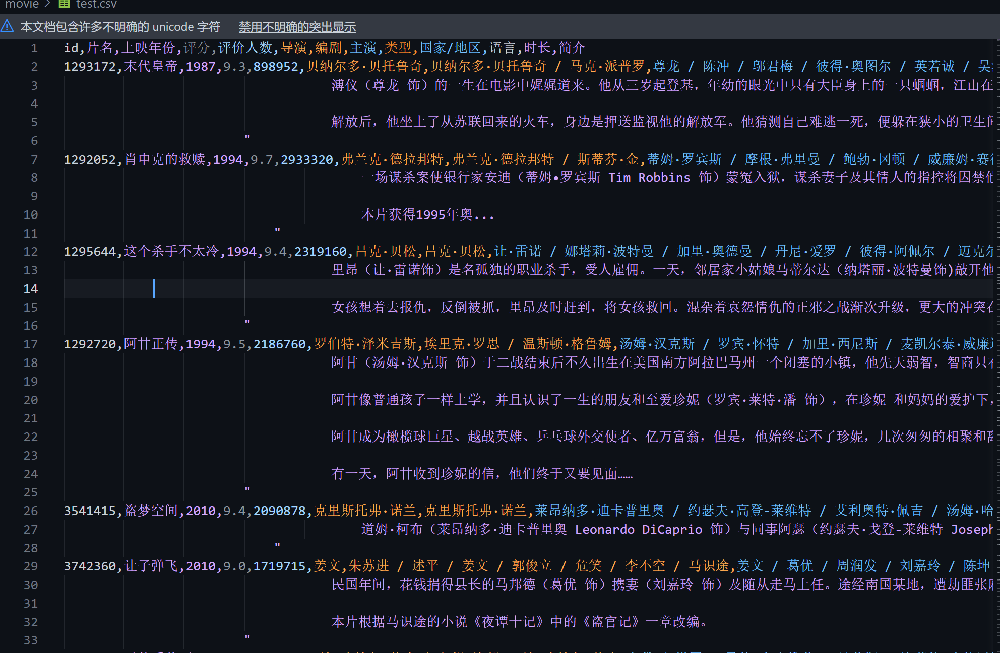


### 数据预处理
#### 分词工具的选择
为了选用一个较好的分词工具，我们对jieba、THULAC两种分词工具进行了对比实验。
运行以下程序，可以得到jieba和THULAC的分词结果，并以csv文件的形式保存到`cmp.csv`文件中。
```python
import csv
import jieba
import thulac

punctuation = '，。！？、（）【】<>《》=：+-*—“”…\n\t\r[] \u3000,/·()'#标点符号
thulac1 = thulac.thulac(seg_only=True)
def cmp():
    with open('baidu_stopwords.txt', 'r', encoding='utf-8') as f:
        stop_words = f.read().split('\n')#停用词表
    with open('movie.csv', newline='', encoding='utf-8-sig') as csvfile:
        reader = csv.DictReader(csvfile)
        for row in reader:
            for i in punctuation:
                row['简介'] = row['简介'].replace(i, '')#去除标点符号
            list_jieba = jieba.cut(row['简介'])

            list_thulac = thulac1.cut(row['简介'])
            list_thulac = [i[0] for i in list_thulac]
            with open('cmp.csv', 'a', newline='', encoding='utf-8-sig') as f:
                csv.DictWriter(f, fieldnames=['id','jieba','thulac']).writerow({'id': row['id'], 'jieba':'/'.join(list_jieba), 'thulac':'/'.join(list_thulac)})
            print(row['id'], list_jieba, list_thulac)

with open('cmp.csv', 'w', newline='', encoding='utf-8-sig') as f:
    csv.DictWriter(f, fieldnames=['id','jieba','thulac']).writeheader()
cmp()
```
节选一部分对比结果如下：
| id | jieba | thulac |
| :----: | :---: | :---:|
|1292052|一场/谋杀案/使/银行家/安迪/蒂姆/•/罗宾斯/TimRobbins/饰/蒙冤/入狱/谋杀/妻子/及其/情人/的/指控/将/囚禁/他/终生/在/肖申克/监狱/的/首次/现身/就让/监狱/大哥/瑞德/摩根/•/弗里/曼/MorganFreeman/饰/对/他/另眼相看/瑞德/帮助/他/搞/到/一把/石锤/和/一幅/女明星/海报/两人/渐成/患难之交/很快/安迪/在/监狱/里/大显/其才/担当/监狱/图书/管理员/并/利用/自己/的/金融/知识/帮助/监狱/官/避税/引起/了/典狱长/的/注意/被/招致/麾下/帮助/典狱长/洗/黑钱/偶然/一次/他/得知/一名/新/入狱/的/小偷/能够/作证/帮/他/洗脱/谋杀罪/燃起/一丝/希望/的/安迪/找到/了/典狱长/希望/他/能/帮/自己/翻案/阴险/伪善/的/狱长/假装/答应/安迪/背后/却/派/人/杀死/小偷/让/他/唯一/能/合法/出狱/的/希望/泯灭/沮丧/的/安迪/并/没有/绝望/在/一个/电闪雷鸣/的/风雨/夜/一场/暗藏/几十年/的/越狱/计划/让/他/自我/救赎/重获/自由/老朋友/瑞德/在/他/的/鼓舞/和/帮助/下/也/勇敢/地奔/向/自由/本片/获得/1995/年/奥/...	|一/场/谋杀案/使/银行/家/安迪蒂姆/•/罗/宾斯TimRobbins/饰蒙/冤入狱/谋杀/妻子/及其/情人/的/指控/将/囚禁/他/终生/在/肖申克/监狱/的/首/次/现身/就/让/监狱/大哥/瑞德/摩根•/弗里曼MorganFreeman饰/对/他/另眼相看/瑞德/帮助/他/搞/到/一/把/石锤/和/一/幅/女/明星/海报/两/人/渐/成/患难之交/很快/安迪/在/监狱/里/大显其才/担当/监狱/图书/管理员/并/利用/自己/的/金融/知识/帮助/监狱/官避税/引起/了/典狱/长/的/注意/被/招致/麾下/帮助/典狱/长洗/黑钱/偶然/一/次/他/得知/一/名/新/入狱/的/小偷/能够/作证/帮/他/洗/脱谋/杀罪/燃起/一/丝/希望/的/安迪/找到/了/典狱/长/希望/他/能/帮/自己/翻案/阴险/伪善/的/狱长/假装/答应/安迪/背后/却/派/人/杀死/小偷/让/他/唯一/能/合法/出狱/的/希望/泯灭/沮丧/的/安迪/并/没有/绝望/在/一个/电闪雷鸣/的/风雨夜/一/场/暗藏/几十/年/的/越狱/计划/让/他/自我/救赎/重/获/自由/老朋友/瑞德/在/他/的/鼓舞/和/帮助/下/也/勇敢/地/奔/向/自由/本片/获得/1995年/奥/...

可以看到，THULAC分词结果有些不尽人意，比如 一场 被分词成了 一/场，银行家 被分词成了 银行/家，这些分词结果不符合人的直觉，
而结巴分词结果则比较符合人的直觉。因此我们最终选择了jieba作为分词工具。

#### 分词结果的处理
jieba分词结果中，有些词语是无意义的，比如“的”、“了”、“是”等，这些词语被称为停用词。我们使用了百度停用词表，将停用词从分词结果中去除，并将分词结果保存到csv文件中。
除此之外，我们还将分词结果中的标点符号去除，并将分词结果中的空格去除。
最后把预处理结果保存到`movie_pretreat.csv`文件中。
```python
import jieba
import csv


punctuation = '，。！？、（）【】<>《》=：+-*—“”…\n\t\r[] \u3000,/·()' #标点符号
def pretreat():
    with open('baidu_stopwords.txt', 'r', encoding='utf-8') as f:
        stop_words = f.read().split('\n')#停用词表
    with open('movie.csv', newline='', encoding='utf-8-sig') as csvfile:
        reader = csv.DictReader(csvfile)
        for row in reader:
            print(row['id'])
            print(row['片名'])
            seg_list = jieba.cut_for_search(row['简介']+row['导演']+row['编剧']+row['主演']+row['类型']+row['国家/地区'])
            seg_list = [word for word in seg_list if word not in stop_words]
            seg_list = [word for word in seg_list if word not in punctuation]

            seg_list += row['片名'].split(' ')
            seg_list += row['主演'].replace('\r',' ').replace('\n','').replace('[','').replace(']','').replace("'",'').replace(' ','').split('/')
            seg_list += row['类型'].replace(' ','').split('/')
#            seg_list += row['评分'].split(' ')
            seg_list = [word for word in seg_list if word not in punctuation]           
            print(",".join(seg_list))
            with open('movie_pretreat.csv', 'a', newline='', encoding='utf-8-sig') as f:
               csv.DictWriter(f, fieldnames=['id', 'word']).writerow({'id': row['id'], 'word':','.join(seg_list)})
            print(row['id'])
            
with open('movie_pretreat.csv', 'w', newline='', encoding='utf-8-sig') as f:
    csv.DictWriter(f, fieldnames=['id', 'word']).writeheader()
pretreat()
```
### 建立倒排索引
利用上面的预处理结果，建立倒排索引，将倒排索引保存到`pl.csv`文件中。
```python
import csv


word_map = {}  #字典，key为词语，value为包含该词语的电影id列表
with open('movie_pretreat.csv', newline='', encoding='utf-8-sig') as csvfile:
    reader = csv.DictReader(csvfile)
    for row in reader:
        for word in row['word'].split(','):
            if word not in word_map:
                word_map[word] = [row['id']]
            else:
                if row['id'] not in word_map[word]:
                    word_map[word].append(row['id'])  
for word in word_map:
    #对于每个词语，将包含该词语的电影id列表按照从小到大排序
    word_map[word].sort()
with open('movie_pl.csv', 'w', newline='', encoding='utf-8-sig') as f:
    #将倒排索引保存到pl.csv文件中
    csv.DictWriter(f, fieldnames=['term', ' docID']).writeheader()
    for word in word_map:
        csv.DictWriter(f, fieldnames=['term', 'docID']).writerow({'term': word, 'docID': word_map[word]})
        print(word, word_map[word])
```

### 豆瓣电影检索

#### 检索主体框架

输入检索词项表达式后，使用split函数解析表达式，并调用And、Or、Not子模块，计算得出表达式对应书籍/电影ID列表，并依次打印符合要求的书籍/电影信息。

```python
if __name__ =="__main__":
    input = input("请输入搜索内容：")
    term_and = input.split('|')
    # 得出and项的ID
    id_or = []
    for item_and in term_and:
        id_and = []
        term = item_and.split('&')
        #print(term)
        for item in term:
            #print(item)
            tag_not = 0
            if item[0] == '!' or item[0] == '！':
                tag_not = 1
                item = item[1:]
            id = search_id(item)
            if tag_not == 1:
                id = Not(id)
                #print("item:", item, "id:", id)
            id_and.append(id)
            #print(item, ":", id)
        #print(id_and)
        ID_and = And(id_and)
        #print(ID_and)
        id_or.append(ID_and)
    # 合并andx项ID
    id_final = Or(id_or)
    # print(id_final)
    # 输出结果
    with open('Book.csv', newline='', encoding='utf-8-sig') as csvfile:
        reader = csv.DictReader(csvfile)
        flag = 0
        for row in reader:
            if row['id'] in id_final:
                flag = 1
    #            print(row['id'])
                print(row['书名'])
                #print(row['作者'])
    #            print(row['出版社'])
    #            print(row['译者'])
    #            print(row['出版年'])
    #            print(row['豆瓣评分'])
    #            print(row['内容简介'])
    #            print(row['作者简介'])
        if flag == 0:
            print("无结果")
```

#### 布尔检索实现

Not采用遍历所有ID的方法，取非运算；

And和Or均采用O(m+n)时间复杂度，O(1)空间复杂度的算法实现。

```python
def Not(id_not):
    ID_not = []
    with open('Book.csv', newline='', encoding='utf-8-sig') as csvfile:
        reader = csv.DictReader(csvfile)
        for row in reader:
            if row['id'] not in id_not:
                ID_not.append(row['id'])
    #print(ID_not)
    # sort ID_not
    ID_not.sort()
    return ID_not
def And(id_and):
    ID_and = []
    if(len(id_and) == 0):
        return ID_and
    for i in range(len(id_and)):
        if i == 0:
            ID_and = id_and[i]
            #print("ID_and:", ID_and)
        else:
            if(len(id_and[i]) == 0):
                ID_and = []
                break
            m = 0
            n = 0
            while(m < len(ID_and) and n < len(id_and[i])):
                # print("m:", m, "n:", n)
                # print("ID_and[m]:", ID_and[m], "id_and[i][n]:", id_and[i][n])
                if ID_and[m] == id_and[i][n]:
                    m += 1
                    n += 1
                elif ID_and[m] < id_and[i][n]:
                    ID_and.pop(m)
                else:
                    n += 1
                # print("ID_and:", ID_and)
            if m < len(ID_and):
                for j in range(m, len(ID_and)):
                    ID_and.pop(m)
                # print("ID_and:", ID_and)
    return ID_and

def Or(id_or):
    ID_or = []
    if(len(id_or) == 0):
        return ID_or
    for i in range(len(id_or)):
        if i == 0:
            ID_or = id_or[i]
            #print("ID_or:", ID_or)
        else:
            if(len(id_or[i]) == 0):
                continue
            m = 0
            n = 0
            while(m < len(ID_or) and n < len(id_or[i])):
                if ID_or[m] == id_or[i][n]:
                    m += 1
                    n += 1
                elif ID_or[m] < id_or[i][n]:
                    m += 1
                else:
                    ID_or.insert(m, id_or[i][n])
                    m += 1
                    n += 1
            if n < len(id_or[i]):
                for j in range(n, len(id_or[i])):
                    ID_or.append(id_or[i][j])
    #print("ID_or:", ID_or)
    return ID_or
```

#### 检索效果

布尔检索支持与或表达式的输入格式。支持与、或、非检索。

下图以电影检索为例，为了展示方便，仅仅输出电影名称。

- 输入“日本”：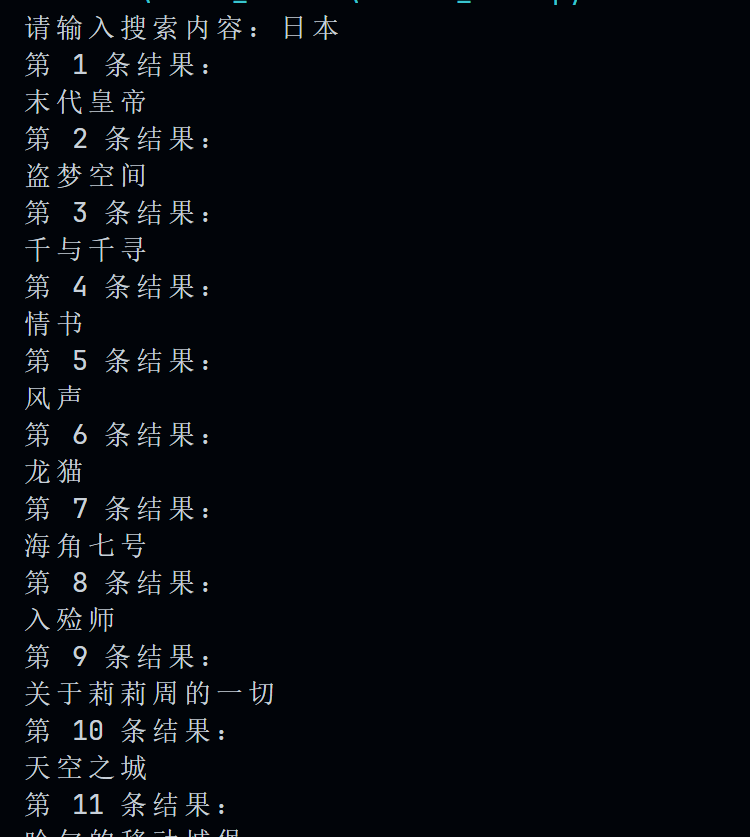
- 输入“日本&柯南”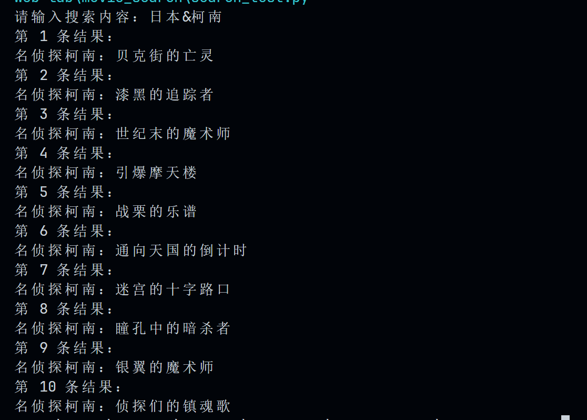
- 输入“日本&柯南&魔术”
- 输入“日本&柯南&!魔术”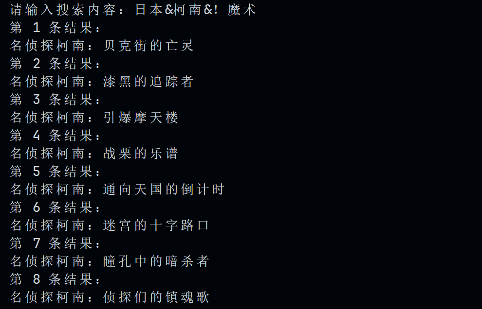
- 输入“日本&柯南|魔术”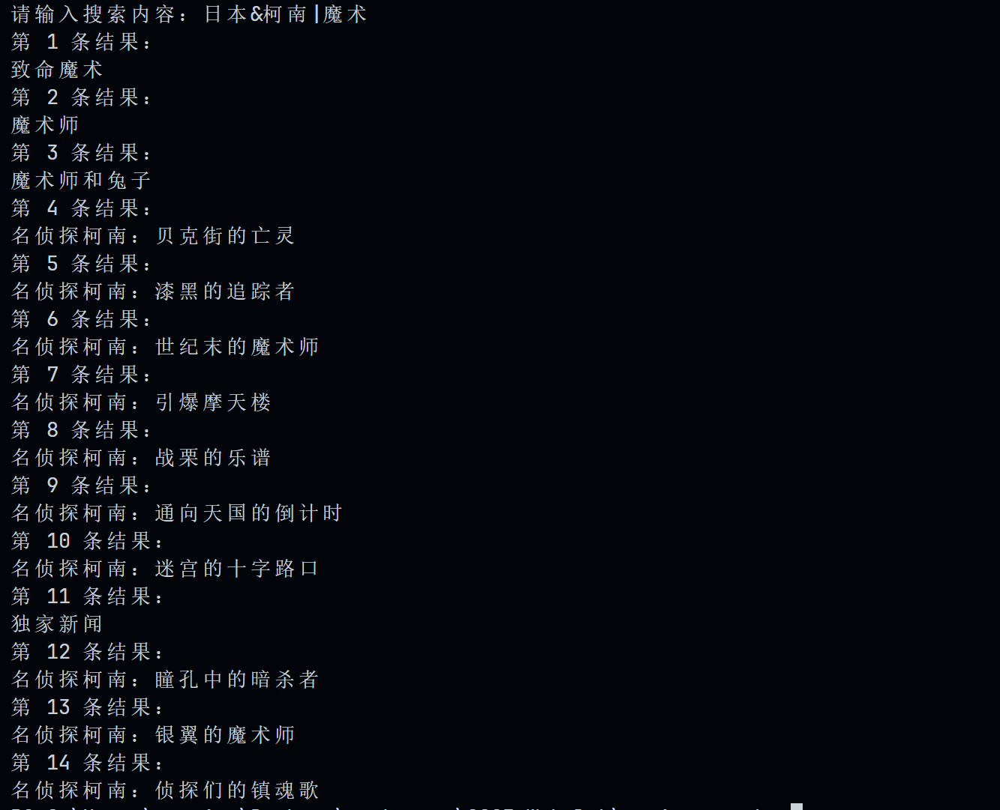


### 索引压缩

#### 压缩方法

本实验采用前端编码的方式来压缩索引(文档id)，先将文档ID转化为文档之间的间隔，即相邻两个文档ID之差，再使用前端编码的方式进行压缩。

#### 压缩过程

先得到文档间距的中间文件：

```python
def zip_interval(srcfile,destfile):
    #按照文档id间距压缩
	with open(file=srcfile, mode='r',encoding="utf_8_sig") as src:
		reader=csv.reader(src)
		result=list(reader)
		with open(file=destfile, mode='w',encoding="utf_8_sig",newline='') as dest:
			writer=csv.writer(dest)
			write_list=[]
			for i in range(1,len(result)):
				pl_row=result[i]
				write_list.append(pl_row[0])
				id_list=pl_row[1].strip('[').strip(']').split(',')
				for j in range(0,len(id_list)):
					if j==0:
						write_list.append(eval(id_list[j]))
					else:
						id_num=int(eval(id_list[j]))-int(eval(id_list[j-1]))
						write_list.append(str(id_num))
				writer.writerow(write_list)
				write_list.clear()
```

再进行前端编码压缩。注意到csv文件是unicode编码，而unicode编码最小单位是16位，这里将ID数字拆成以12位(4095)为单位，第16位设置为延续位。比如数字5000的二进制位：0001001110001000，以12位为单元分割为：

0001，0001 1100 0100

设置延续位(标黑)：

 0000 0000 0000 0001，**1**000 0001 1100 0100

这样将一个数字字符串转化为2个unicode字符。

压缩编码代码为：

```python
def encode(num,base=32):
    #前端编码
    #编码方式为Unicode
    string=""
    while(num>4095):
        low7bits=num%4096 #取num的低12位
        string=string+chr(4096+low7bits+base)
        num=num>>12
    if num<=4095:
        return string+chr(num+base)
def Recode(srcfile,destfile):
    #对间隔id进行前端编码
	with open(file=srcfile, mode='r',encoding="utf_8_sig") as src:
		reader=csv.reader(src)
		result=list(reader)
		with open(file=destfile, mode='w',encoding="utf_8_sig",newline='') as dest:
			writer=csv.writer(dest)
			write_list=[]
			for i in range(0,len(result)):
				src_row=result[i]
				write_list.append(src_row[0])
				for j in range(1,len(src_row)):
					write_list.append(encode(int(src_row[j]),base=32))
				writer.writerow(write_list)
				write_list.clear()
```

注意到Unicode前面32位字符为控制字符，不利于输出和后面的解码，所以加了base，编码从base开始进行，这也是为什么取12位为单位而非15位的原因。

解码则是根据unicode字符数值对文档ID进行还原：

```python
def decode(string,base=32):
	num=0
	for i in range(0,len(string)):
		charnum=ord(string[i])-base
		#print("charnum is "+str(charnum)+"\n")
		if(charnum>4095):
			num+=(charnum-4096)*(4096**i)
		else:
			num+=(charnum)*(4096**i)
	return num
def unzip(srcfile,destfile):
    #解压回原文件
	header=["term"," docID"]
	with open(file=srcfile, mode='r',encoding="utf_8_sig") as src:
		reader=csv.reader(src)
		result=list(reader)
		with open(file=destfile, mode='w',encoding="utf_8_sig",newline='') as dest:
			writer=csv.writer(dest)
			writer.writerow(header)
			write_list=[]
			for src_row in result:
				write_list.append(src_row[0])
				write_string=""
				num=0
				for i in range(1,len(src_row)):
					num+=decode(src_row[i],base=32)
					write_string+="\'"+str(num)+"\'"
					if i==1:
						write_string="["+write_string
					if i==len(src_row)-1:
						write_string=write_string+"]"
					else:
						write_string=write_string+", "
				write_list.append(write_string)
				writer.writerow(write_list)
				write_list.clear()
```

#### 压缩效果

以豆瓣图书倒排表为例,压缩前：


生成的文档间距文件interval.csv和压缩文件plzip.csv：

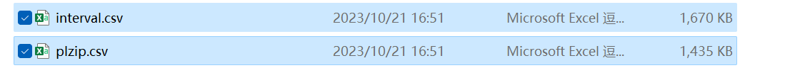

可以得到压缩率为:
$$
\frac{1435KB}{2735KB}\times100\%=52.468\%
$$
比较解压后的文件plunzip.csv和原文件pl.csv，可得两者文件完全相同：

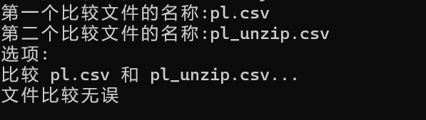


### Funk-SVD算法预测评分

#### 算法原理

Funk Singular Value Decomposition（Funk-SVD）是一种用于协同过滤推荐系统的算法，它通过分解用户-物品评分矩阵来预测用户对未评分物品的评分。该算法的核心思想是将评分矩阵分解为三个矩阵的乘积，这三个矩阵分别表示用户、物品和特征。

下面是Funk-SVD算法的基本原理：

1. **用户-物品评分矩阵：** 在协同过滤推荐系统中，用户-物品评分矩阵是一个包含用户对物品评分的矩阵。这个矩阵通常是稀疏的，因为用户只对少数物品进行了评分。
2. **矩阵分解：** Funk-SVD通过将用户-物品评分矩阵分解为三个矩阵的乘积来进行建模。这三个矩阵分别是用户矩阵（U），物品矩阵（V），和对角矩阵（Σ）。
   - **用户矩阵（U）：** 包含用户和特征之间的关系。每一行对应一个用户，每一列对应一个特征。
   - **物品矩阵（V）：** 包含物品和特征之间的关系。每一行对应一个物品，每一列对应一个特征。
   - **对角矩阵（Σ）：** 包含特征的权重。它是一个对角矩阵，表示特征对于评分的重要性。
3. **预测评分：** 通过将用户矩阵、物品矩阵和对角矩阵相乘，得到一个近似的用户-物品评分矩阵。
4. **优化：** 目标是最小化实际评分与预测评分之间的差距。通常采用梯度下降等优化算法，通过迭代调整用户矩阵和物品矩阵的元素，使得预测评分逼近实际评分。

#### 预处理数据

由于Funk-SVD算法需要将用户评分数据转换为评分矩阵，而原始数据中用户信息仅有ID信息，没有序号信息，所以必须建立用户ID到序号的一一映射。

同理，必须建立项目ID到序号的一一映射。

以电影数据为例，进行预处理时，扫描movie_score.csv，将用户id转换为序号存入user.csv中，将电影id转换为序号存入movie.csv中。

```python
# -*- coding: gbk -*-
import csv

with open('./recommend/rating.csv', 'w', newline='', encoding='utf-8-sig') as f:
    csv.DictWriter(f, fieldnames=['userId', 'movieId', 'rating', 'timestamp']).writeheader()
    user = []
    movie = []
    with open('./recommend/movie_score.csv', newline='', encoding='utf-8-sig') as csvfile:
        pl = csv.DictReader(csvfile)
        for row in pl:
            # print(row['User'], row['Rate'])
            # 将用户id转换为1-943存入新的列表中
            if row['User'] not in user:
                user.append(row['User'])
            # 将电影id转换为1-1682存入新的列表中
            if row['Movie'] not in movie:
                movie.append(row['Movie'])
            csv.DictWriter(f, fieldnames=['userId', 'movieId', 'rating', 'timestamp']).writerow({'userId': user.index(row['User'])+1, 'movieId': movie.index(row['Movie'])+1, 'rating':row['Rate'], 'timestamp':row['Time']})
        # print(user)
        # print(movie)
    #保存用户id和电影id
    with open('./recommend/user.csv', 'w', newline='', encoding='utf-8-sig') as f:
        csv.DictWriter(f, fieldnames=['userId']).writeheader()
        for i in range(len(user)):
            csv.DictWriter(f, fieldnames=['userId']).writerow({'userId': user[i]})
    with open('./recommend/movie.csv', 'w', newline='', encoding='utf-8-sig') as f:
        csv.DictWriter(f, fieldnames=['movieId']).writeheader()
        for i in range(len(movie)):
            csv.DictWriter(f, fieldnames=['movieId']).writerow({'movieId': movie[i]})


```

最终效果如下：

- 用户ID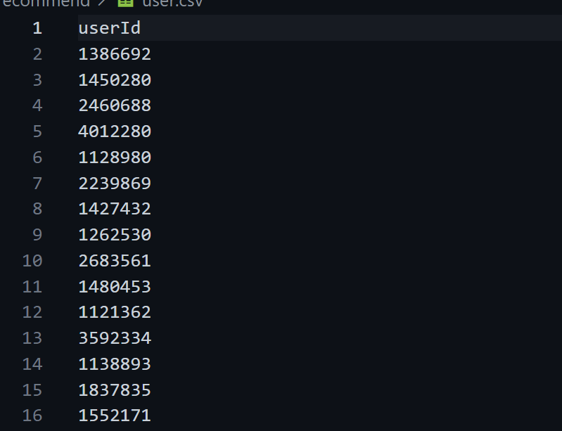
- 电影ID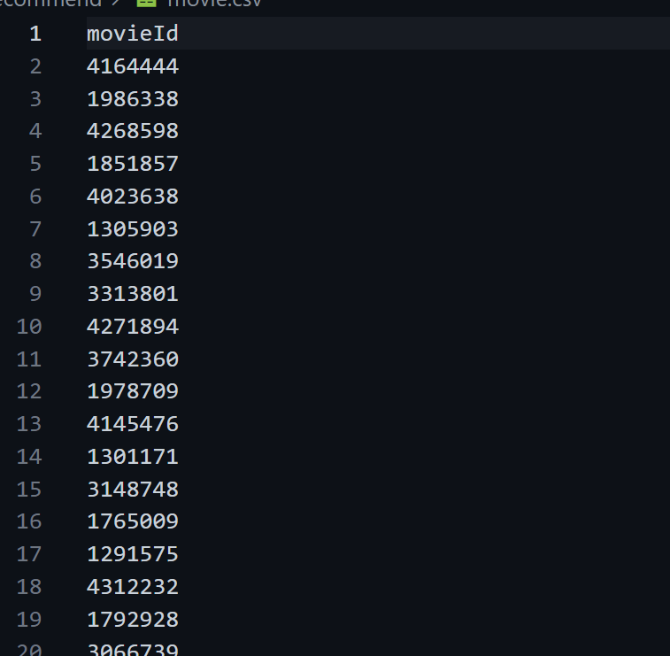

#### 数据集划分

使用random库函数打乱评分数据，随后划分数据为两部分，一半训练，一半测试。

```python
# 数据读取
reader = Reader(line_format='user item rating timestamp', sep=',', skip_lines=1)
data = Dataset.load_from_file('./recommend/rating.csv', reader=reader)

# 随机打乱数据
raw_ratings = data.raw_ratings
random.shuffle(raw_ratings)

# 将数据分成两部分（一半训练，一半测试）
threshold = int(0.5 * len(raw_ratings))
train_raw_ratings = raw_ratings[:threshold]
test_raw_ratings = raw_ratings[threshold:]
# 修改测试数据格式以仅包含用户ID、物品ID和实际评分
modified_test_raw_ratings = [(uid, iid, r_ui) for (uid, iid, r_ui, timestamp) in test_raw_ratings]
```

#### 训练和预测

使用surprise的**SVD**模型进行训练和预测，并使用accuracy.rmse进行简单评估。

```python
# 构建训练集和测试集
data.raw_ratings = train_raw_ratings  # 仅使用一半的数据作为训练集
trainset = data.build_full_trainset()
# train_set = data.build_full_trainset()

# 使用funkSVD
algo = SVD(biased=False)#这里默认是True，使用的是biasSVD

# 存储测试集的预测结果
all_predictions = []

# 训练并预测
algo.fit(trainset)
predictions = algo.test(modified_test_raw_ratings)
all_predictions.append(predictions)

# 输出测试结果
with open('./recommend/svd_test.csv', 'w', newline='', encoding='utf-8-sig') as f:
    csv.DictWriter(f, fieldnames=['user', 'Movie', 'Rate']).writeheader()
    for uid, iid, r_ui, est, _ in predictions:
        csv.DictWriter(f, fieldnames=['user', 'Movie', 'Rate']).writerow({'user': uid, 'Movie': iid, 'Rate': est})

# 计算RMSE
rmse = accuracy.rmse(predictions, verbose=True)
print(f"RMSE on the other half of the data: {rmse}")
```

#### 运行结果

生成svd_predict.csv文件，包含对于测试集的预测结果。

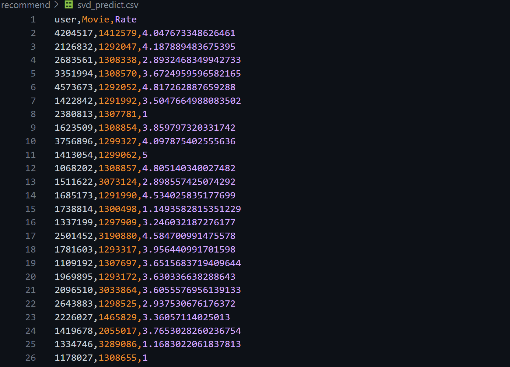

### K-近邻算法预测评分

#### 算法原理

- 计算训练样本和测试样本中每个样本点的距离（常见的距离度量有欧式距离，马氏距离等）；
- 对上面所有的距离值进行排序；
- 选前k个最小距离的样本；
- 根据这k个样本的标签进行投票，得到最后的分类类别；

#### 预处理数据

由于K-近邻算法基于计算样本点之间的距离，所以样本数据必须为数字，不能包含字符串等其他格式。

这里，我们只采用book_score.csv或movie_score.csv文件的信息，包含：

- 用户ID
- 书籍/电影ID
- 评分
- 时间
- Tag

进行预处理时，考虑到不同用户对同一类物品的差距可能很大，为了反应这一差距，直接将用户ID数字串转换为数字。同理，对于书籍ID也进行类似操作。对于时间，只取小时部分。而对于评论的标签，考虑到同一评论的Tag相似，直接按照顺序进行映射。由于大多数用户评论的tag较少，只取用户评论的前4个Tag，如下为预处理数据的过程：

```python
#预处理阶段
loaded_data=pd.read_csv('data\\book_score.csv')
All_Tag=[]
maxlen=0
Tag1_list=[]
Tag2_list=[]
Tag3_list=[]
Tag4_list=[]
Time_hour=[]
User_list=[]
User_id=[]
item_list=[]
item_id=[]
with open(file="data\\book_score.csv",encoding="utf-8-sig") as f:
    reader=csv.reader(f)
    result=list(reader)
    for i in range(1,len(result)):
        row=result[i]
        tag_list=list(row[4].split(","))
        time=str(row[3])
        Time_hour.append(int(time[11:13]))
        if(row[0] in User_list) is False:
            User_list.append(row[0])
        User_id.append(User_list.index(row[0]))
        if(row[1] in User_list) is False:
            item_list.append(row[1])
        item_id.append(item_list.index(row[1]))
        if(len(tag_list)==0):
            continue
        if(len(tag_list)>maxlen):
            maxlen=len(tag_list)
        for tag in tag_list:
            if((tag in All_Tag) is False):
                All_Tag.append(tag)
        if(len(tag_list)==0):
            Tag1_list.append(0)
            Tag2_list.append(0)
            Tag3_list.append(0)
            Tag4_list.append(0)
        if len(tag_list)==1:
            Tag1_list.append(All_Tag.index(tag_list[0]))
            Tag2_list.append(0)
            Tag3_list.append(0)
            Tag4_list.append(0)
        if len(tag_list)==2:
            Tag1_list.append(All_Tag.index(tag_list[0]))
            Tag2_list.append(All_Tag.index(tag_list[1]))
            Tag3_list.append(0)
            Tag4_list.append(0)
        if len(tag_list)==3:
            Tag1_list.append(All_Tag.index(tag_list[0]))
            Tag2_list.append(All_Tag.index(tag_list[1]))
            Tag3_list.append(All_Tag.index(tag_list[2]))
            Tag4_list.append(0)
        if len(tag_list)>=4:
            Tag1_list.append(All_Tag.index(tag_list[0]))
            Tag2_list.append(All_Tag.index(tag_list[1]))
            Tag3_list.append(All_Tag.index(tag_list[2]))
            Tag4_list.append(All_Tag.index(tag_list[3]))
loaded_data["Tag1"]=Tag1_list
loaded_data["Tag2"]=Tag2_list
loaded_data["Tag3"]=Tag3_list
loaded_data["Tag4"]=Tag4_list
loaded_data["Time_hour"]=Time_hour
loaded_data["User_id"]=User_id
loaded_data["item_id"]=item_id
loaded_data.to_csv("pretreat.csv")

```

#### 数据集划分

使用train_test_split()函数，将源文件随机打乱，训练集和测试集大小均为50%。

```python
#分割数据集
loaded_data=pd.read_csv('pretreat.csv')
train_data, test_data = train_test_split(loaded_data, test_size=0.5, random_state=42,shuffle=True)
test_data=pd.DataFrame(test_data)
test_data.sort_values(by=["User","Rate"],ascending=[True,False],inplace=True)
test_data.to_csv("test.csv",index=False)
```

#### 训练和预测

使用sklearn的**KNeighborsClassifier**模型进行训练和预测，并使用accuracy_score()进行简单评估。

```python
#训练
train=train_data[["User","Tag1","Tag2","Tag3","Tag4","Time_hour"]]
target=train_data["Rate"]
knn=KNeighborsClassifier(n_neighbors=20,weights="distance",algorithm="auto",leaf_size=30)
knn.fit(train,target)
#预测
x_test=test_data[["User","Tag1","Tag2","Tag3","Tag4","Time_hour"]]
y_test=test_data["Rate"]
y_predict=knn.predict(x_test)
test_data["Rate"]=y_predict
test_data.sort_values(by=["User","Rate"],ascending=[True,False],inplace=True)
test_data.to_csv("predict.csv",index=False)
print(accuracy_score(y_test,y_predict)) #简单评估预测准确率
```

我们发现，如果同时使用User和Book的ID信息，得到的预测分数只有0.39。但如果去掉Book这一列信息，预测分数会显著增加到0.57。但是当去掉其他列信息，得到的分数不仅不会显著增加，反而可能减少。猜测原因是，对于同一本书，不同的用户预测分数可能有很大差异，所以最终使用：

- 用户ID
- 时间
- Tag(前4项)
- 评分

这些信息。
### 预测结果评估
#### NDCG的计算
```python
import pandas as pd
import math

def compute_DCG(rel_list):
    dcg = 0.0
    for i in range(len(rel_list)):
        dcg += (2 ** rel_list[i] - 1) / math.log2(i + 2)
    return dcg

def compute_NDCG(predictions, targets):
    ndcg = []
    for i in range(len(predictions)):
        pred = predictions[i]
        target = targets[i]

        # 根据评分对预测结果进行排序
        sorted_pred = [x for _, x in sorted(zip(target, pred), reverse=True)]
        # 计算预测结果的DCG
        dcg_pred = compute_DCG(sorted_pred)
        # 计算真实结果的DCG
        dcg_target = compute_DCG(target)

        # 如果DCG_target为0，则NDCG为0
        if dcg_target == 0:
            ndcg.append(0)
        else:
            # 计算NDCG
            ndcg.append(dcg_pred / dcg_target)
    return ndcg

def compute_mse(predictions, targets):
    mse = []
    for i in range(len(predictions)):
        pred = predictions[i]
        target = targets[i]

        # 计算预测结果和真实结果的均方误差
        mse.append(sum([(pred[i] - target[i]) ** 2 for i in range(len(pred))]) / len(pred))
    return mse

# 读取预测文件和测试文件的CSV文件
predictions_df = pd.read_csv('predict.csv')
targets_df = pd.read_csv('test.csv')

# 获取用户和评分列的数据
users_pred = predictions_df['User'].tolist()
ratings_pred = predictions_df['Rate'].tolist()
users_target = targets_df['User'].tolist()
ratings_target = targets_df['Rate'].tolist()

# 将用户和评分列的数据按照用户进行分组
users_pred_grouped = predictions_df.groupby('User')
users_target_grouped = targets_df.groupby('User')

# 用于存储每个用户的预测评分和真实评分
predictions = []
targets = []

# 遍历每个用户
for user in users_pred_grouped.groups.keys():
    # 获取该用户的预测评分
    user_pred_ratings = users_pred_grouped.get_group(user)['Rate'].tolist()
    # 获取该用户的真实评分
    user_target_ratings = users_target_grouped.get_group(user)['Rate'].tolist()

    # 将该用户的预测评分和真实评分添加到列表中
    predictions.append(user_pred_ratings)
    targets.append(user_target_ratings)

# 计算NDCG
ndcg = compute_NDCG(predictions, targets)

print('NDCG:', sum(ndcg) / len(ndcg)) 

# 计算MSE
mse = compute_mse(predictions, targets)
print('MSE:', sum(mse) / len(mse)) 

```
以上代码是使用原始的NDCG计算公式计算NDCG，并且顺便计算了MSE，最终会输出NDCG和MSE的平均值。   
计算结果如下图所示：  
knn算法：  
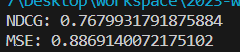  
SVD算法：  
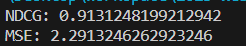  
可以看到，SVD算法的NDCG比KNN算法的要好，说明SVD算法的预测效果比KNN算法的要好。  

